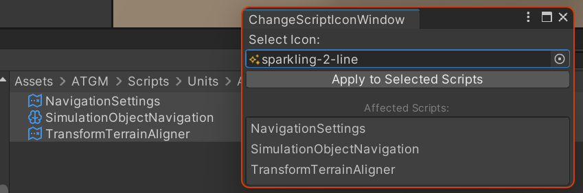
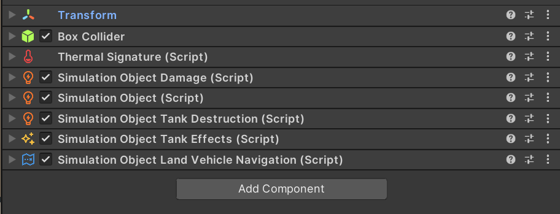

# UnityScriptIconChanger

A simple utility editor window for changing icons of multiple scripts at the same time.

Currently (Unity 2021.3.24f1) Unity does not allow to change the icon of multiple scripts at the same time.
You have to manually change the icon of each script one by one and wait for a reimport after each change.
This is a simple utility editor window that allows to do that in batches.

## Installation

Put the `ChangeScriptIconWindow.cs` file in an `Editor` folder in your project or in an editor-only assembly as it
obviously needs `UnityEditor`.

## Usage

1. Open the window from `Window/Change script icons`[^1] or right click a script asset and click on `Change icons for
   selected scripts` [^1] [^2].

2. Select the icon you want to use for the selected scripts.

3. Click on `Apply to Seleced Scripts` to change the icon of the selected scripts.

[^1]: Window menu option text as well as context menu option text can be changed in the `ChangeScriptIconWindow.cs`
file.
[^2]: This option is only available if you have selected at least one script asset (not a scriptable object instance although changing the icon of a scriptable object script will change the icon of all instances of that scriptable object).
